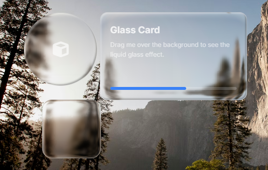

<div align="center">
<h1>GlassiFy</h1>

<p>
<strong>Next-generation liquid glass effects for the modern web.</strong>
</p>

<h3>
<a href="https://glassify.saviru.me">🌐 Official Website</a>
&nbsp;&nbsp;|&nbsp;&nbsp;
<a href="https://glassify.saviru.me">GlassiFy.Saviru.me</a>
</h3>

<p>
<a href="https://github.com/username/glassify/releases">

</a>
<a href="https://github.com/username/glassify/blob/main/LICENSE">

</a>
</p>
</div>

**GlassiFy** is a lightweight, high-performance JavaScript library that brings the `"Liquid Glass"` aesthetic to any HTML element. Unlike standard CSS backdrop-filter methods, Glassify introduces dynamic capabilities including real-time turbulence and refraction.

It works natively with the DOM, requiring **NO** frameworks (React, Vue, Angular compatible), and is designed to be fully responsive and touch-friendly.

<center>


</center>

### Features
- **Two Rendering Modes:**
    - **Default:** A crisp, static frosted glass (similar to Apple/iOS aesthetics).
    - **Super:** A dynamic, liquid surface with customizable turbulence and flow.
- **Lightweight:** Zero dependencies, highly optimized, minimal impact on performance and loading times.
- **Easy to use:** Just include the library and apply the `glassify` class to your elements.
- **Customizable:** Fine-tune blur, refractive scale, brightness, and noise octaves.
- **Drop-in Ready:** Uses Web Components for instant setup.


### Installation

#### Option 1: GlassiFy CDN (Recommended)

Add the script directly to your HTML ```<head>``` or before the closing ```</body>``` tag.
```html
<!-- Replace {version} with the specific version number -->
<script src="https://glassify.saviru.me/cdn/{version}/glassify.js"></script>

<!-- OR remove version to get latest version -->
<script src="https://glassify.saviru.me/cdn/glassify.js"></script>
```
#### Option 2: Self-Hosted

Download the latest release and include it in your project directory.
```html
<script src="./assets/js/glassify.js"></script>
```

### Usage   
#### 1. Initialize the Engine
Place the ```<glassi-fy>``` custom element anywhere inside your ```<body>```. This acts as the controller for the global effect.

#### Traditional Liquid Glass (Default Mode)
```html
<glassi-fy></glassi-fy>
```
#### Turbulent Liquid Glass (Super Mode)
```html
<glassi-fy mode="super"></glassi-fy>
```

#### 2. Mark Your Elements
Add the ```.glassify``` class to any container you want to transform.
```html
<div class="glassify card">
    <h2>Glass Card</h2>
    <p>Content floating on liquid glass.</p>
</div>
```

#### 3. Style with CSS
While **GlassiFy** handles the refraction, blur and other effects, you must define the dimensions.

```css
.card {
    width: 400px;
    height: 250px;
    border-radius: 16px;
}
```
Btw, If you want to customize it further you can customize any style properties using CSS variables:
> 💡 Pro Tip: Use ```rgba``` backgrounds with low alpha values (0.2 - 0.5) to allow the glass refraction to shine through.
```css
.card {
    width: 400px;
    height: 250px;
    border-radius: 16px;
    /* Essential for the glass effect visibility */
    background-color: rgba(255, 255, 255, 0.15); 
    border: 1px solid rgba(255, 255, 255, 0.3);
    color: white;
}
```

### Advanced Configurations

Configure the global effect by adding attributes to the ```<glassi-fy>``` tag.

#### Example: High Turbulence Setup
```html
<glassi-fy 
    mode="super" 
    scale="60" 
    blur="8" 
    frequency="0.02" 
    octaves="4">
</glassi-fy>
```

#### Supported Attributes
<table class="docs-table">
                        <thead>
                            <tr>
                                <th>Attribute</th>
                                <th>Default</th>
                                <th>Range</th>
                                <th>Description</th>
                                <th>Mode</th>
                            </tr>
                        </thead>
                        <tbody>
                            <tr>
                                <td><span class="code-tag">frequency</span></td>
                                <td>0.01</td>
                                <td>0 - 1</td>
                                <td>Controls the turbulence frequency.</td>
                                <td>Super Only<sup><span style="color: red;"> *</span></sup></td>
                            </tr>
                            <tr>
                                <td><span class="code-tag">octaves</span></td>
                                <td>3</td>
                                <td>2 - 8</td>
                                <td>Level of detail in the noise.</td>
                                <td>Super Only<sup><span style="color: red;"> *</span></sup></td>
                            </tr>
                            <tr>
                                <td><span class="code-tag">scale</span></td>
                                <td>45</td>
                                <td>25 - 75</td>
                                <td>Displacement scale magnitude.</td>
                                <td>Any</td>
                            </tr>
                            <tr>
                                <td><span class="code-tag">blur</span></td>
                                <td>3</td>
                                <td>2 - 10</td>
                                <td>Blur radius for background elements.</td>
                                <td>Any</td>
                            </tr>
                            <tr>
                                <td><span class="code-tag">brightness</span></td>
                                <td>1.4</td>
                                <td>1 - 2</td>
                                <td>Backdrop brightness intensity.</td>
                                <td>Any</td>
                            </tr>
                        </tbody>
                    </table>

<sup><span style="color: red;"> *</span></sup> Attributes marked are exclusive to the "Super" mode.

### Demo
You can see a live demo of GlassiFy in action [here](https://glassify.saviru.me).

### License

```Copyright (c) 2025 Saviru Kashmira Atapattu```

This project is licensed under the MIT License. See the [LICENSE](LICENSE) file for details

### Contributing
Contributions are welcome! If you have any suggestions or improvements, feel free to open an issue or submit a pull request.

<hr>
<p align="center">Made with ❤️ for Web Development Community</p>

